# Software Requirements Specification <!-- omit in toc -->
Cyclops Ride Assist: Real-Time Monitoring System   
__Team 9__  
Aaron Li (lia79)  
Amos Cheung (cheuny2)  
Amos Yu (yua25)  
Brian Le (leb7)  
Manny Lemos (lemosm1)  

 <!-- Page Break -->

## Table of Contents <!-- omit in toc -->
- [1. Revision History](#1-revision-history)
- [2. Project Drivers](#2-project-drivers)
  - [2.1. Project Purpose](#21-project-purpose)
  - [2.2. Project Scope](#22-project-scope)
  - [2.3. Behaviour Overview](#23-behaviour-overview)
  - [2.4. Project Stakeholders](#24-project-stakeholders)
  - [2.5. End Users](#25-end-users)
- [3. Project Constraints](#3-project-constraints)
  - [3.1. Mandated Constraints](#31-mandated-constraints)
  - [3.2. Naming Conventions and Definitions](#32-naming-conventions-and-definitions)
    - [3.2.1. Naming Conventions](#321-naming-conventions)
    - [3.2.2. Constants](#322-constants)
    - [3.2.3. Monitored Variables](#323-monitored-variables)
    - [3.2.4. Controlled Variables](#324-controlled-variables)
  - [3.3. Relevant Facts and Assumptions](#33-relevant-facts-and-assumptions)
    - [3.3.1. Relevant Facts](#331-relevant-facts)
    - [3.3.2. Assumptions](#332-assumptions)
- [4. Context Diagrams](#4-context-diagrams)
- [5. Functional Decomposition Diagrams](#5-functional-decomposition-diagrams)
- [6. Functional Requirements](#6-functional-requirements)
  - [6.1. Scope of Work](#61-scope-of-work)
  - [6.2. Business Data Model and Data Dictionary](#62-business-data-model-and-data-dictionary)
  - [6.3. Scope of the Product](#63-scope-of-the-product)
  - [6.4. Functional Requirements](#64-functional-requirements)
    - [6.4.1. CRA Requirements](#641-cra-requirements)
- [7. Non-Functional Requirements](#7-non-functional-requirements)
  - [7.1. Look and Feel Requirements](#71-look-and-feel-requirements)
    - [7.1.1. Appearance Requirements](#711-appearance-requirements)
    - [7.1.2. Style Requirements](#712-style-requirements)
  - [7.2. Usability and Humanity Requirements](#72-usability-and-humanity-requirements)
    - [7.2.1. Ease of Use Requirements](#721-ease-of-use-requirements)
    - [7.2.2. Personalization and Internationalization Requirements](#722-personalization-and-internationalization-requirements)
    - [7.2.3. Learning Requirements](#723-learning-requirements)
    - [7.2.4. Understandability and Politeness Requirements](#724-understandability-and-politeness-requirements)
    - [7.2.5. Accessibility Requirements](#725-accessibility-requirements)
  - [7.3. Performance Requirements](#73-performance-requirements)
    - [7.3.1. Speed and Latency Requirements](#731-speed-and-latency-requirements)
    - [7.3.2. Safety-Critical Requirements](#732-safety-critical-requirements)
    - [7.3.3. Precision and Accuracy Requirements](#733-precision-and-accuracy-requirements)
    - [7.3.4. Reliability and Availability Requirements](#734-reliability-and-availability-requirements)
    - [7.3.5. Robustness or Fault-Tolerance Requirements](#735-robustness-or-fault-tolerance-requirements)
    - [7.3.6. Capacity Requirements](#736-capacity-requirements)
    - [7.3.7. Scalability and Extensibility Requirements](#737-scalability-and-extensibility-requirements)
    - [7.3.8. Longevity Requirements](#738-longevity-requirements)
  - [7.4. Operational and Environmental Requirements](#74-operational-and-environmental-requirements)
    - [7.4.1. Expected Physical Environment](#741-expected-physical-environment)
    - [7.4.2. Requirements for Interfacing with Adjacent Systems](#742-requirements-for-interfacing-with-adjacent-systems)
    - [7.4.3. Productization Requirements](#743-productization-requirements)
    - [7.4.4. Release Requirements](#744-release-requirements)
  - [7.5. Maintainability and Support Requirements](#75-maintainability-and-support-requirements)
    - [7.5.1. Maintenance Requirements](#751-maintenance-requirements)
    - [7.5.2. Supportability Requirements](#752-supportability-requirements)
    - [7.5.3. Adaptability Requirements](#753-adaptability-requirements)
  - [7.6. Security Requirements](#76-security-requirements)
    - [7.6.1. Access Requirements](#761-access-requirements)
    - [7.6.2. Privacy Requirements](#762-privacy-requirements)
    - [7.6.3. Immunity Requirements](#763-immunity-requirements)
  - [7.7. Cultural and Political Requirements](#77-cultural-and-political-requirements)
    - [7.7.1. Cultural Requirements](#771-cultural-requirements)
  - [7.8. Legal Requirements](#78-legal-requirements)
    - [7.8.1. Compliance Requirements](#781-compliance-requirements)
    - [7.8.2. Standards Requirements](#782-standards-requirements)
- [8. Project Issues](#8-project-issues)
  - [8.1. Open Issues](#81-open-issues)
  - [8.2. Off-the-Shelf Solutions](#82-off-the-shelf-solutions)
    - [8.2.1. Ready-Made Products](#821-ready-made-products)
    - [8.2.2. Reusable Components](#822-reusable-components)
  - [8.3. Risks](#83-risks)
  - [8.4. Costs](#84-costs)
- [9. Waiting Room](#9-waiting-room)
  - [9.1. Likely Changes](#91-likely-changes)
  - [9.2. Unlikely Changes](#92-unlikely-changes)
- [10. Appendix](#10-appendix)
  - [10.1. Reflection](#101-reflection)

## List of Tables <!-- omit in toc -->
- [Table 1.1: Revision History](#rh)
- [Table 10.1.1: List of Symbolic Parameters](#sp)

## List of Figures <!-- omit in toc -->
- [Figure 4.1: CRA System Context Diagram](#scd)  
- [Figure 5.1: CRA Functional Decomposition Diagram](#fdd)  
- [Figure 5.2: CRA Data Flow Diagram](#dfd)  
- [Figure 5.3: Legend for the CRA Data Flow Diagram](#lcdfd)  

## 1. Revision History

Table 1.1: Revision History

| Date | Developer(s) | Change |
|:--|:--|:--|
| 2022-10-03 | Aaron Li, Amos Cheung, Amos Yu, Brian Le, Manny Lemos | Document created |
| 2022-10-20 | Amos Yu | Improved formatting |
| 2022-11-06 | Amos Yu | Addressed peer review suggestions |
| 2023-02-05 | Aaron Li | Updated SRS for current state |
| 2023-04-01 | Aaron Li, Amos Yu | Updated SRS for Rev1 |

## 2. Project Drivers

### 2.1. Project Purpose

The goal of the CRA is to help cyclists have the ultimate peace of mind when they’re travelling. It will allow users to have a convenient system that will reduce the likelihood of a car-bicycle collision and, in the unfortunate event of an crash, to log data and videos that will help recreate what exactly happened.

Cyclops Ride Assist (CRA) is going to be an all-in-one, easily installable, and easy-to-use system that adds modern car safety features onto a bike, such as rear vehicle detection and crash detection. Furthermore, the CRA will feature automatic video, LiDAR, and accelerometer data upload to a flash drive.

### 2.2. Project Scope

CRA is going to be a bike assist system with convenient mounting, accurate crash detection, video buffering and saving, data logging, and reliable rear vehicle detection that helps cyclists to increase their awareness while riding on the road. CRA will be of great value for road cyclists who cycle in urbanized areas. Furthermore, cyclists who ride on mountains or trails will still benefit from the features it provides.

### 2.3. Behaviour Overview

The user can press the power button to turn on the CRA. Once it turns on, it will start to record the forward point of view of the bike. If a bike crash is detected, the system will store the past BUFFER_TIME of footage so the user can look back at the events leading up to the crash. Also on the back side of the system, CRA will watch out for cars approaching the bike at blind spots and alert the cyclist with an LED indicator.

### 2.4. Project Stakeholders

| Stakeholder | Representatives |
|:--|:--|
| Project Proposers | Aaron Li, Amos Cheung, Amos Yu, Brian Le, Manny Lemos |
| Project Supervisor | Spencer Smith |
| Teaching Assistants | Nicholas Annable, Christopher Schankula, Timofey Tomashevskiy, Samuel Crawford, Ting-Yu Wu |
| End Users | (see [End Users](#25-end-users)) |

### 2.5. End Users

The end users will be all cyclists.

## 3. Project Constraints

### 3.1. Mandated Constraints

A list of constraints which will adhered to during the design and development of this system.

| Mandated Constraint 1 | This capstone project must be completed prior to the final demonstration. |
|:--|:--|
| Rationale 1 | Project deadlines provided in the course outline dictate project milestone which must be met. One such milestone is the final demonstration which occurs between March 20-31 2023. |  

| Mandated Constraint 2 | The total cost of the components used in this design must not exceed $750. |
|:--|:--|
| Rationale 2 | The final deliverable must be a competitor in the open market. Further, using funds to purchase an off-the-shelf product is not allowed. |

| Mandated Constraint 3 | The embedded system must be able to independently analyze inputs to produce desired results in real time. |
|:--|:--|
| Rationale 3 | The complete system should be able to function in isolation. Real time analysis and response is an integral component of the Cyclops Ride Assist system. More precisely, desired results are only of value if they can be delivered on time every time. |

### 3.2. Naming Conventions and Definitions

#### 3.2.1. Naming Conventions

| Name | Explanation |
|:--|:--|
| Client | A person who will purchase the CRA product. See User. |
| CRA | Abbreviation of Cyclops Ride Assist. |
| Cyclist | A person who operates a bicycle as a means of transportation. |
| User | A person who will operate the CRA product. See Cyclist. |

#### 3.2.2. Constants

| Constant Name | Constant Description | Type | Units |
|:--|:--|:--|:--|
| GRAVITY | Acceleration due to gravity. | float | m/s2 |
| CRASH_THRESHOLD | The maximum acceleration incurred during a crash. | integer | m/s2 |
| MAX_DISTANCE | The maximum distance that the rear vehicle detection will monitor. | float | m |
| BUFFER_TIME | The length of footage that will be saved after an accident occurs. | integer | seconds |
| RESPONSE_RATE | The polling rate at which the output is updated to match the current input. | integer | Hz |
| FRAMERATE | The framerate of the front-facing video | integer | fps |

#### 3.2.3. Monitored Variables

| Monitor Name | Monitor Description | Type | Units |
|:--|:--|:--|:--|
| αx | Measures acceleration parallel to the path of the bicycle. | float | m/s2 |
| αy | Measures acceleration perpendicular to the path of the bicycle along the plane of the ground. | float | m/s2 |
| αz | Measures acceleration in the vertical direction. | float | m/s2 |
| tilt | Measures the horizontal tilt of the system calibrated relative to the ground. | float | m/s2 |
| norm | Measures the total magnitude of the acceleration vector. | float | m/s2 |
| vfront | Video feed from the front-facing camera. | video | resolution |
| vrear | Data feed from the rear-facing sensor. | float | m |

#### 3.2.4. Controlled Variables

| Controlled Name | Controlled Description | Type | Units |
|:--|:--|:--|:--|
| poweroff_flag | To control the power status of the system. | boolean | ul |
| log_flag | To indicate that video and data from the past BUFFER_TIME should be logged. | boolean | ul |
| leds_on | The number of LEDs that are lit up at a time. | integer | ul |

### 3.3. Relevant Facts and Assumptions

#### 3.3.1. Relevant Facts

- A Raspberry Pi 4 B can consume up to 6.4 watts of power under maximum CPU load.
- The average adult bicycle is 175 cm long, with handlebars ranging from 38 cm for smaller road bikes to 61 cm for larger mountain bikes. 

#### 3.3.2. Assumptions
Assumptions will enable developers to cull the scope of the problem(s) being undertaken. As such, assumptions will detail limitations of the system.  
| Assumption 1 | Cyclists will mount and dismount their bikes with care. |
|:--|:--|
| Rationale 1  | Violent mounting and dismounting of one's bicycle may result in unintended triggering of crash detection and subsequent video logging. The system will not be able to distinguish between violent (dis)mounting and true crashes. |

| Assumption 2 | Cyclists will travel in the same direction on the road as motorized traffic. |
|:--|:--|
| Rationale 2 | The blind spot monitoring is intended to warn the cyclist of danger when a car is approaching the cyclist from behind. If the cyclist is travelling in the opposite direction on the road as motorized traffic, the blind spot monitoring system is rendered ineffective as it is unable to detect danger due to cars approaching from the front. |

| Assumption 3 | When a cyclist crashes, the bike is abruptly struck and falls over. |
|:--|:--|
| Rationale 3 | During normal operation, a sudden increase in acceleration followed by a flipped acceleration vector constitutes a crash. A crash did not happen when a stationary cyclist falls over on their bike. A crash did not happen when a cyclist slams on the brakes. A crash did not happen when a cyclist hops a curb and keeps cycling. |

| Assumption 4 | Cyclists will provide their own power source for the CRA. |
|:--|:--|
| Rationale 3 | In order to simplify the installation process of the CRA, cyclists will be expected to separately provide and mount their own battery/power source to the bike. This will reduce cost and allow users to more easily dismount their batteries for charging, and to have multiple batteries on hand in case one dies. |

## 4. Context Diagrams

Figure 4.1: CRA System Context Diagram

  

## 5. Functional Decomposition Diagrams

Figure 5.1: CRA Functional Decomposition Diagram

  

Figure 5.2: CRA Data Flow Diagram

Figure 5.3: Legend for the CRA Data Flow Diagram

  

## 6. Functional Requirements

### 6.1. Scope of Work

CRA will be separated into 3 main components: Microcontroller, Rear Vehicle Detection, Crash Detection. The scope of the functional requirements will include the mounting hardware, microcontroller, rear vehicle detection, crash monitoring. Each system will be developed as its own module and then brought together with communications between each module facilitated through the microcontroller. Varying parts of the project will be distributed to each member to be completed with the final goal being to merge each for a final product.

### 6.2. Business Data Model and Data Dictionary

Refer to section 3.2.3 Monitored Variables for the dictionary used throughout the Functional Requirements.

### 6.3. Scope of the Product

The scope of the product will be a physical enclosure which will contain the microcontroller, sensors, and battery required to facilitate all of CRA's functionalities. The product will be mounted onto a bike where CRA can then monitor a riders rearview and whether a crash has occurred. The rearview detection will be relayed to the user through a visible LED on the enclosure facing a side which the user can clearly see in their FOV. The product will be capable of clipping/logging the first and last few seconds of real time video when the user gets into a crash. When visibility becomes an issue during late riding hours, the user will also have a light to turn on at their disposal for increased clarity.

### 6.4. Functional Requirements

#### 6.4.1. CRA Requirements

| CFR1 | CRA must be able to incrementally light up a row of LEDs. |
|:--|:--|
| Function | Light_LED(distance) returns leds_on = (1 to n) where distance = (0 to MAX_DISTANCE)
| Rationale | CRA should be able to visually inform the rider that there is an obstacle approaching from the rear. |
| Priority | Medium |

| CFR2 | CRA must be able to continuously collect data from a front-facing video feed throughout the user's ride. |
|:--|:--|
| Rationale | CRA needs the live front-facing video feed for video logging upon crash detection. |
| Priority | High |

| CFR3 | CRA must be able to take in accurate acceleration information throughout the user's ride. |
|:--|:--|
| Function | Acceleration(αx, αy, αz) returns norm = 3d(αx, αy, αz) and tilt = 2d(αx, αz) |
| Rationale | CRA needs the accurate acceleration to determine when a crash has occurred. |
| Priority | Medium |

| CFR4 | CRA must be able to take in accurate rear vehicle distance information. |
|:--|:--|
| Function | Vehicle_Detected(rrear) returns distance = (0 to MAX_DISTANCE) |
| Rationale | CRA needs an accurate distance to determine where the vehicle behind it is located. |
| Priority | Medium |

| CFR7 | CRA must detect crashes. |
|:--|:--|
| Function | Crash_Monitor(αx, αy, αz, tilt, norm) returns is_crashed = (True or False) |
| Rationale | CRA should recognize when to discard buffered video footage and when to save it. |
| Priority | High |

| CFR8 | CRA must capture the last BUFFER_TIME seconds and the following MAX_UPLOAD_TIME seconds of video and data when a crash is detected. |
|:--|:--|
| Function | Crash_Log(vfront) returns video_feed and data where len(video_feed) = (BUFFER_TIME + MAX_UPLOAD_TIME) and len(data) = (BUFFER_TIME + MAX_UPLOAD_TIME) |
| Rationale | CRA should save the video feed of the moments leading up to the crash on the integrated SD card |
| Priority | Medium |

| CFR10 | CRA must save video and data captures to the SD card if a flash drive is not connected. |
|:--|:--|
| Function | Flash_Connected(is_mounted) returns flash_path = path where is_mounted = (True or False)
| Rationale | CRA should be able to run the crash detection and save logs even if a flash drive is not detected by the system. If a flash drive is connected, CRA should prefer it. |
| Priority | Low |

| CFR11 | CRA shall be able to determine when a component is no longer operational due to improper connection. |
|:--|:--|
| Rationale | If a component is unable to perform its function as intended, it should be disabled rather than continue to provide unreliable data. |
| Priority | Low |

| CFR12 | CRA must be able to continue running its video feed after a clip is logged. |
|:--|:--|
| Rationale | CRA should keep the system rolling in the case that the user is able to continue biking after an initial crash. |
| Priority | Medium |

| CFR13 | CRA must be able to continue running after a crash is detected. |
|:--|:--|
| Rationale | CRA should keep the system rolling in the case that the user wants to continue biking after an initial crash. |
| Priority | High |

| CFR15 | CRA must allow the user the option to capture the last BUFFER_TIME seconds of video and data at any point during their ride. |
|:--|:--|
| Function | Capture_Log(vfront) returns video_feed and data where len(video_feed) = BUFFER_TIME and len(data) = BUFFER_TIME |
| Rationale | On top of capturing video and data during a crash, the user should also have the ability to save that data whenever they want. There may be situations of interest that do not necessarily involve a crash. |
| Priority | Medium |

## 7. Non-Functional Requirements

### 7.1. Look and Feel Requirements

#### 7.1.1. Appearance Requirements 

| CNFR1 | The surface of CRA will have retroreflective regions. |
|:--|:--|
| Rationale | This is to act as a safety mechanism to allow the bicycle/motorbike to be more visible at night. |
| Priority | High |

| CNFR2 | CRA will be contained in a mechanically created system mounted on the bicycle. |
|:--|:--|
| Rationale | This is to ensure that the the components will not interfere with the system or with the physical bicycle itself. |
| Priority | High |
  
| CNFR3 | There will be no offensive painting or colours on CRA. |
|:--|:--|
| Rationale | This is to ensure that no one is offended by the design style. |
| Priority | Medium |

#### 7.1.2. Style Requirements 

| CNFR4 | CRA will be non-bulky and constructed in a minimalist way. |
|:--|:--|
| Rationale | This is to ensure that the system does not become distracting for the users or others on the road. |
| Priority | Medium |
  
### 7.2. Usability and Humanity Requirements

#### 7.2.1. Ease of Use Requirements 

| CNFR5 | CRA can be easily attached to the bicycle with minimal effort. |
|:--|:--|
| Rationale | This is to ensure that the user will want to and find it easy to use the product. |
| Priority | Medium |

| CNFR6 | The software application of CRA will allow for a minimal amount of clicks or touches. |
|:--|:--|
| Rationale | This will allow users to easily access the files and videos they require. |
| Priority | Medium |

| CNFR7 | CRA will be designed in a way that can be easily understood and used by teenagers and adults for their own bicycles. |
|:--|:--|
| Rationale | This is to ensure that the system can be understood easily by different age groups. |
| Priority | Medium |

| CNFR8 | CRA will be able to be used by people who have not have prior experience with the device. |
|:--|:--|
| Rationale | This is to ensure that the device can be used by anyone regardless of ability or educational background |
| Priority | Medium |

#### 7.2.2. Personalization and Internationalization Requirements

| CNFR9 | Users will be able to make small modifications to CRA. |
|:--|:--|
| Rationale | This is needed so that users can make adjustments to allow the system to better fit their own personal bicycle. |
| Priority | High |

#### 7.2.3. Learning Requirements 

| CNFR10 | An instruction manual will accompany the CRA device. |
|:--|:--|
| Rationale | This is to ensure that the device can be learned by anyone regardless of ability or educational background. |
| Priority | Medium |

| CNFR11 | CRA will be able to be created by an engineer with one week of training. |
|:--|:--|
| Rationale | This is so that any engineer can upgrade or perform maintenance on the system easily. |
| Priority | High |

#### 7.2.4. Understandability and Politeness Requirements 

| CNFR12 | The software application of CRA will use lanaguge, words, and symbols that are non-technical and understandable by a regular user. |
|:--|:--|
| Rationale | This is so that it will be understandable by the global community of users. |
| Priority | Medium |

#### 7.2.5. Accessibility Requirements 

| CNFR13 | CRA will have signals and cues to alert the user. |
|:--|:--|
| Rationale | This is in the case that a user may have some visual or auditory impairment. |
| Priority | High |

| CNFR14 | CRA will be able to be mounted to all types of bicycles. |
|:--|:--|
| Rationale | This is to ensure that as many users can benefit. |
| Priority | Low |

### 7.3. Performance Requirements

#### 7.3.1. Speed and Latency Requirements 

| CNFR15 | CRA will have a maximum response rate of RESPONSE_RATE. |
|:--|:--|
| Rationale | This is to ensure that the user is able to use CRA quickly and get on their way. |
| Priority | Medium |

| CNFR16 | CRA will upload the video file to the flash drive with a max time of MAX_UPLOAD_TIME. |
|:--|:--|
| Rationale | This is to ensure that the user is able to access their files quickly. |
| Priority | Low |

| CNFR17 |  CRA will be able to determine an accident within 5s. |
|:--|:--|
| Rationale | This is to ensure that the camera will keep the recording of before and after the collision. |
| Priority | High |

| CNFR18 |  CRA can update if a car is nearby to alert the user at a rate of RESPONSE_RATE. |
|:--|:--|
| Rationale | This is to allow the user to have enough time to ensure they are in a safe position. |
| Priority | High |

| CNFR19 |  CRA will have an alert on its software application to let the user if the storage is low. |
|:--|:--|
| Rationale | This is to ensure CRA will store data in the case of a collision. |
| Priority | Low |

#### 7.3.2. Safety-Critical Requirements 

| CNFR21 |  CRA will not cause any external damage to the bicycle. |
|:--|:--|
| Rationale | This is to ensure the CRA which could result in loss of safety for the rider. |
| Priority | High |

| CNFR22 | CRA will not emit any harmful toxins to the environment. |
|:--|:--|
| Rationale | This is to ensure that there is no risk to the environment. |
| Priority | Medium |

| CNFR23 | CRA will have all wiring shielded from human contact. |
|:--|:--|
| Rationale | This is to ensure that the user is not negatively affected. |
| Priority | Low |

#### 7.3.3. Precision and Accuracy Requirements 

| CNFR24 | The precision of CRA will be to three decimal places. |
|:--|:--|
| Rationale | This is to keep as many significant digits to ensure relative precision with other components. |
| Priority | Medium |

| CNFR25 | The accuracy of CRA acceleration reading with be within 0.5 m/s2. |
|:--|:--|
| Rationale | This is to ensure that the system is working coherently with the accelerometer subsystem and software application. |
| Priority | Medium |

| CNFR26 | The accuracy of CRA timed camera reading with be within 0.1 second. |
|:--|:--|
| Rationale | This is to ensure that the accuracy of the collision is timed correctly. |
| Priority | Medium |

#### 7.3.4. Reliability and Availability Requirements 

| CNFR27 | The camera on CRA will be able to record once the previous video has finished uploading to storage. |
|:--|:--|
| Rationale | This is to ensure that Cyclops can continuously run for the user. |
| Priority | Medium |

| CNFR28 | CRA will be able to be used 24 hours per day, 365 days per year. |
|:--|:--|
| Rationale | This is to ensure that bikers are covered throughout all times of anyday of any season. |
| Priority | Medium |

#### 7.3.5. Robustness or Fault-Tolerance Requirements 

| CNFR29 | CRA will be able to work consistently even in the case of user drops when in transport. |
|:--|:--|
| Rationale | This is to ensure that CRA is set up to withstand accidents at home or on the road. |
| Priority | Low |

#### 7.3.6. Capacity Requirements 

| CNFR30 | CRA will store a maximum of 16GB worth of video files that do not exceed 25MB in size |
|:--|:--|
| Rationale | This is to ensure that the user is able to see past videos and continuously record new videos, minimizing downtime. |
| Priority | Medium |

#### 7.3.7. Scalability and Extensibility Requirements 

| CNFR31 | CRA will have extra room in its software and hardware storage to allow for additional components. |
|:--|:--|
| Rationale |This is to ensure that CRA is scaleable to additional upgrades. |
| Priority | Low |

| CNFR32 | CRA will be compatible with all bicycle models for the next ten years. |
|:--|:--|
| Rationale | This is to allow for continuous integration into newer bicycles. Users will be able to replace their bicycles without having to also replace their CRA. |
| Priority | Medium |

#### 7.3.8. Longevity Requirements 

| CNFR33 | CRA will have a lifespan of two years with expected cleaning and maintenance. |
|:--|:--|
| Rationale | This is expected due to deterioration of the products. |
| Priority | Medium |

### 7.4. Operational and Environmental Requirements

#### 7.4.1. Expected Physical Environment 

| CNFR34 | The expected physical environment will be on a road. Other possible physical environments include trails, sidewalks, pathways. |
|:--|:--|
| Rationale | This is expected as most cyclists use their bicycles outdoors. |
| Priority | Low |

| CNFR35 | CRA will be used by cyclists in any type of weather. |
|:--|:--|
| Rationale | This is expected as most cyclists use their bicycles outdoors. |
| Priority | Medium |

 #### 7.4.2. Requirements for Interfacing with Adjacent Systems

| CNFR36 | Components of the CRA can be interfaced with other software applications and hardware systems such as PCs and adapters. |
|:--|:--|
| Rationale | This will include the video storage cards and CRA software GUI. |
| Priority | Medium |

#### 7.4.3. Productization Requirements 

| CNFR37 | CRA's hardware and software will be publicly available for use to those interested in furthering the system. |
|:--|:--|
| Rationale | This will allow for continuous improvement of the product by external developers. |
| Priority | Low |

#### 7.4.4. Release Requirements 

| CNFR38 |  CRA will be available as a one-time download and system integration per user |
|:--|:--|
| Rationale | This will also allow for continuous improvement of the product by external developers. |
| Priority | Low |

### 7.5. Maintainability and Support Requirements

#### 7.5.1. Maintenance Requirements

| CNFR39 |  CRA will have crash logs when the software or hardware fails. |
|:--|:--|
| Rationale | This is to allow for the developers to work on a fix for the issue. |
| Priority | High |

| CNFR40 |  CRA will be built in several modules. |
|:--|:--|
| Rationale | This is so that components can be removed and replaced when need be. |
| Priority | Medium |

#### 7.5.2. Supportability Requirements

| CNFR41 |  CRA will have an instruction manual included. |
|:--|:--|
| Rationale | This is to ensure that any common mistakes or confusion can be fixed easily by the user. |
| Priority | Medium |

#### 7.5.3. Adaptability Requirements

| CNFR42 | CRA's external hardware storage will be able to run under any operating system to view files. |
|:--|:--|
| Rationale | This is to ensure that CRA is compatible and adaptable with any system for all users. |
| Priority | Medium |

### 7.6. Security Requirements

#### 7.6.1. Access Requirements

| CNFR43 |  CRA will allow the users to access their videos freely from an external flash drive. |
|:--|:--|
| Rationale | This is to allow the user to connect it to various systems. |

#### 7.6.2. Privacy Requirements

| CNFR44 |  CRA will not store any data in the cloud to protect the user's personal privacy. |
|:--|:--|
| Rationale | The data will only be stored in the user's personal flash drive. |
| Priority | Low |

#### 7.6.3. Immunity Requirements

| CNFR45 | CRA will be connected per user locally. |
|:--|:--|
| Rationale | This is to ensure that there will be no malicious interference from unwanted third-parties. |
| Priority | Medium |

### 7.7. Cultural and Political Requirements

#### 7.7.1. Cultural Requirements

| CNFR46 | CRA will have its primary language set as English (Canadian). |
|:--|:--|
| Rationale | This is the language of the primary developers. |
| Priority | Medium |

| CNFR47 | CRA will not have any offensive language |
|:--|:--|
| Rationale | This is to not offend any users. |
| Priority | High |

### 7.8. Legal Requirements

#### 7.8.1. Compliance Requirements

| CNFR48 | CRA must follow all safety requirements according to the user's bicycle's standards and requirements. |
|:--|:--|
| Rationale | This will include weight and size restrictions to ensure adherance to all types of bicycles. |
| Priority | High |

#### 7.8.2. Standards Requirements

| CNFR49 | CRA will comply with all product quality standards for automotive products. |
|:--|:--|
| Rationale | This will include all processes between idea generation to customer use and satisfaction and will ensure that the industry will not blacklist the product. |
| Priority | Medium |

## 8. Project Issues

### 8.1. Open Issues
A complete list of open and closed issues are available in the [Issues](https://github.com/amosyu2000/cyclops/issues) tab of our GitHub repository. At this current point in time, some open issues include: 

1. Updating the housing to improve the accessibility of the flash drive.
1. Tuning the crash detection algorithm to respond quicker and with a higher rate of accuracy.
1. Combining the on button and the off button into a single on/off switch.
1. Improving water-resistance.

### 8.2. Off-the-Shelf Solutions

#### 8.2.1. Ready-Made Products

| Product Name | Product Description | Website |
|:--|:--|:--|
| INNOVV ThirdEYE | INNOVV ThirdEYE is a blindspot detection system for motorcycles that uses sensors to determine if there are any objects close to the user. It can be either used through a mirror lens or a watch. | https://www.innovv.com/innovv-thirdeye |
| Senzar Motorcycle Sensor | The Senzar Motorcycle Sensor is another system that uses LEDs, vibration, and radar sensors. | https://meetsenzar.com/pages/senzar-m1-motorcycle-bsm |
| Garmin Dash CamTM Series | Garmin provides a product line of dashcams that feature voice-control, HD video and audio, LTE connectivity, and 360 degree monitoring. | https://www.garmin.com/en-CA/c/automotive/dash-cams-backup-cameras/ |
| MEC Bike Mirrors | Mountain Equipment Co-op has a range of stylish bike mirrors that mount onto a bicycle's handlebars. | https://www.mec.ca/en/products/cycling/bike-accessories-and-add-ons/mirrors/c/817 |

#### 8.2.2. Reusable Components

1. Cameras
1. Sensors
1. Buttons
1. Accelerometers
1. Distance sensors
1. Cables, connectors, and wires
1. Printed circuit boards

### 8.3. Risks

Risks are outlined extensively in the [Hazard Analysis](../HazardAnalysis/HazardAnalysis.md) document.

### 8.4. Costs

1. Raspberry Pi microcontroller
1. Peripheral components (buttons, cables, sensors, etc.)
1. 3D Printing (cost of time, material cost)
1. Printed circuit boards
1. Software (3D modelling software, development tools)
1. Bicycle

## 9. Waiting Room

### 9.1. Likely Changes

| Requirement | Change Description |
|:--|:--|
CNFR1 | The appearance could be other colors if designers decide to make a change. |
CNFR24 | Based on the impplementation the precision could change to ensure better accuracy. |
CNFR25 | Based on the impplementation the precision could change to ensure better accuracy. |
CNFR26 | Based on the impplementation the precision could change to ensure better accuracy. |
CNFR32 | The duration could change based on the method of implementation used during design process. |
CNFR33 | The lifespan could increase or decrease when designing the product. |

### 9.2. Unlikely Changes

| Requirement | Description |
|:--|:--|
| CFR1 | This is one of the core function blind spot detection. |
| CFR2 | This is one of the core function crash detection. |
| CFR3 | This is one of the core requirements of crash detection. |
| CFR4 | This is one of the core requirements of crash detection and blind spot detection. |
| CFR7 | This is one of the core requirements of crash detection. |
| CFR8 | This is one of the core requirements of crash detection. |
| CFR9 | This is one of the core requirements of crash detection. |
| CFR10 | This is one of the core requirements of crash detection. |
| CFR11 | Components needed to be powered in order to have CRA fully working at all times. |
| CFR12 | This is one of the core requirements of crash detection. |
| CNFR2 | A container would be needed to put all components together. |
| CNFR3 | This is one of the core value of the designers to keep everyone inclusive and safe while using the product. |
| CNFR4 | CRA has to be carried around easily and also not obstructing the user when cycling. |
| CNFR5 | This is one of the goal of the product. |
| CNFR6 | This is one of the requirements for a user friendly product. |
| CNFR7 | This is one of the requirements for a user friendly product. |
| CNFR8 | This is one of the requirements for a user friendly product. |
| CNFR9 | Allowing changes to the system will make it more user friendly. |
| CNFR10 | This is one of the requirements for a user friendly product. |
| CNFR11 | This simplifies the maintanence process. |
| CNFR12 | This is one of the requirements for a user friendly product. |
| CNFR13 | This is to make sure the system is inlcusive to all cyclist even if they might have disabilities. |
| CNFR14 | This is one of the requirements for a user friendly product. |
| CNFR15 | This is one of the requirements for a user friendly product. |
| CNFR16 | This is one of the requirements for a user friendly product. |
| CNFR17 | This is a core function of crash detection. |
| CNFR18 | This is a core requirements for blind spot detection. |
| CNFR19 | This is to ensure that the videoing part of crash detection would not be obstructed by other external factors. |
| CNFR20 | Components needed to be powered in order to have CRA fully working at all times. |
| CNFR21 | This is to keep the safety of the cyclist and also to keep the bike in it's original form. |
| CNFR22 | This is to ensure the safety of the users and environment. |
| CNFR23 | This is to ensure the safety of the users. |
| CNFR27 | This is to ensure the product is functioning properly. |
| CNFR28 | This is to ensure the product is functioning properly. |
| CNFR29 | This is a requirements to ensure product is durable. |
| CNFR30 | This is one of the core function of crash detection. |
| CNFR31 | This is needed to achieve strech goals of the project. |
| CNFR34 | This is required in order for the product to work. |
| CNFR35 | This is required in order for the product to work. |
| CNFR36 | This is desired to expand the product's usability. |
| CNFR37 | External help could improve and make the product more robust. |
| CNFR38 | External help could improve and make the product more robust. |
| CNFR39 | This will help developers to make changes when nesessary to ensure the product is in good condition. |
| CNFR40 | This is needed as the product has a lot of componenets and functions. |
| CNFR41 | This is one of the requirements for a user friendly product. |
| CNFR42 | This is one of the requirements for a user friendly product. |
| CNFR43 | This is one of the requirements for a user friendly product. |
| CNFR44 | This is to ensure the privacy of the user. |
| CNFR45 | This is to ensure the privacy of the user. |
| CNFR46 | This is the most well known language around the world to ensure most people can understand and use the product. |
| CNFR47 | This is one of the core value of the designers to keep everyone inclusive and safe while using the product. |
| CNFR48 | This is to ensure the safety of the user. |
| CNFR49 | This is to ensure the product is safe for the users and also the surroundings. |

## 10. Appendix

### 10.1. Reflection

There is a lot of knowledge and skills that our team is going to need to acquire to successfully complete our capstone project. From learning how to write formal documentation such as the SRS to pushing to our Github repository, all these tasks have taught our team a lot about the non-coding side of software. 
As we move along in the project, there will be a lot of ideas and skills that the team are looking forward to learning. 

Being an effective and productive team is a multifaceted problem which must be tackled strategically. Perhaps more important than any specific skill, learning to work together and play to one another's strengths will propel Cyclops to success. One important tool in achieving this success is project planning. Every individual in this group will take accountability for project planning. This consists of organizing meetings, scheduling work to meet deadlines, and clearly articulating one's own intentions of completing work to other group members. Frequent communication between team members is crucial in ensuring everyone is on the same page and working towards a common goal. Another critical skill involved in productive teamwork is conflict management. Undoubtedly, at some point during the capstone project, there will be differences in opinion. However, it is how team members react to these disagreements which will be the deciding factor between sinking or swimming. It is expected that team members will support one another and try their best to view problems from the other's point of view, be open-minded and respectful, and most importantly clearly communicate how they feel and what they expect from others. As the team progresses into the latter half of the course, presentations will become more frequent. Successful presentation skills can drastically elevate the perceived success of a project. As such, it is critical that team members practice their presentation skills, present as a united front understanding what and when our teammates will present, and be ready to assist them. 

One of the skills that our team is looking forward to is the mechanical side of the project. As mainly mechatronics and software students, we rarely use CAD modeling software; however, we believe that these designs will be key to our capstone. A couple of approaches that we will be taking are learning through practice by watching online videos and tutorials, using coursework from previous courses, as well as consulting our colleagues and peers for their own input. Furthermore, we will be looking at models that exist already to further cement our own designs. Aaron Li will be heading this section as he has a lot of expertise, modeling in both AutoCAD and SolidWorks from his past co-op experiences. Every other team member will have input to the designs, prototypes, and final product. Being able to work together through every step of the mechanical process is going to set our team up for success now and in the future.  

Electrical engineering will be the bridge between the software and hardware domains. It is the means by which the hardware domain can collect and send data to be processed, and by which the software is able to interact with the physical world. Amos Cheung will be in charge of electrical engineering. On top of a theoretical understanding of electrical systems, he will need to become comfortable with applying his knowledge in the form of soldering, handling electrical components, noise reduction, and heat management. This may require the team to invest time and money to ensure that Amos Cheung is properly equipped with the skills to reliably read and apply electrical schematics.

This project will also require a significant amount of software development knowledge, as the software is ultimately the brains of the entire system. On top of learning the microcontroller's programming language at a syntactic level, we also need to ensure that the code being written is clean and maintainable. Although a bottleneck when initially beginning development, testing will save time in the long run by identifying bugs while they are small. Testing will also help in the separation of concerns between software and other domains - knowing that the software is functioning as intended will help pinpoint bugs in other areas. Amos Yu will be put in charge of getting software testing up and running for the team. Implementing a strong testing regime will be the best way to ensure that code remains maintainable as it grows and gets more complex.

In order to optimize software processes, leverage APIs, and ultimately complete this project within the time constraints of a single university year, our team will undoubtedly have to take advantage of the many open-source software libraries/packages. For each package that we use, we will need to spend a considerable amount of time reading documentation to understand how to use the package correctly and effectively. 

The scope of this project also includes the Computer Vision domain. This includes understanding how to facilitate machine learning and AI’s for the vehicle recognition system. Brian Le will take initiative in this aspect of the system because he has already had exposure to the technologies relating that would be then used to build the required functionalities. Manny Lemos is very interested as well in this field and is looking forward to assisting as well in this area. Approaches for the team to acquire knowledge within this domain would include diving deep into open sources projects with similar goals and technologies. Being able to experiment and play around in these open source projects will give our team understanding on how proper AI’s are trained and deployed as well as what theory is required in order to make an AI successful. Another route our team could take to ramp up on this domain would be to find feature sets online and use them to train models from scratch using different libraries and methods. Getting a feel on each model's use case would be very beneficial to understanding which model would fit the needs of our system the most.
